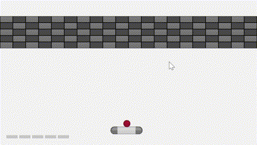

# Arkanoid

This project is a clone of the classic arcade game Arkanoid, built using the raylib graphics library. It features a simple yet engaging gameplay where players must break bricks with a ball that bounces off a paddle controlled by the player.




## How to Run

To run this game, ensure you have raylib installed on your system. You can compile the project using the provided Makefile (assuming you are on a platform that supports Make):

```bash
make
./arkanoid